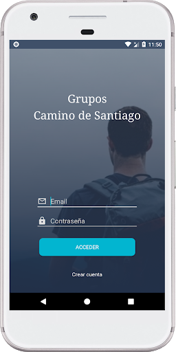
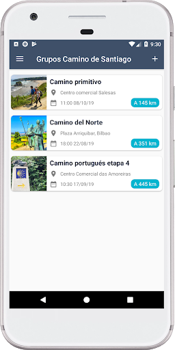
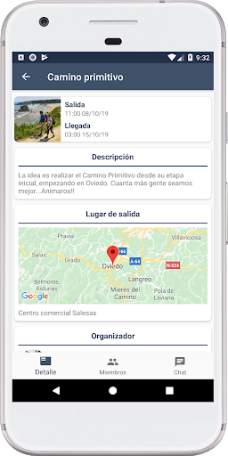
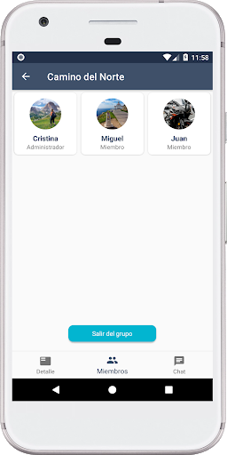
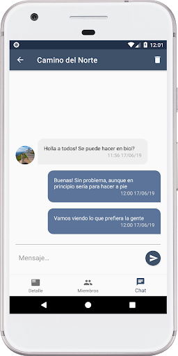

# Android-Grupos-Camino-Santiago

Grupos Camino de Santiago  is a kotlin app that allows create groups to do the Camino de Santiago

## Architecture pattern
[Model‑View‑Viewmodel](https://en.wikipedia.org/wiki/Model–view–viewmodel) (MVVM)

## Captures

## Third Party Libraries
* [rxjava](https://github.com/ReactiveX/RxJava)
* [Google Maps](https://developers.google.com/maps/documentation/android-sdk)
* [Retrofit 2](http://square.github.io/retrofit/)
* [OkHttp3](https://github.com/square/okhttp)
* [Room](https://developer.android.com/training/data-storage/room)

